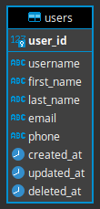

# users-crud

## 1 Clone repository

Clone repository and install dependencies:

```bash
$ git clone git@github.com:EliseevNP/users-crud.git
$ cd users-crud
$ npm i
```

## 2 Start application

Copy enviroment variables:

```bash
$ cp .env.example .env
```

Setup database:

```bash
# start database
$ docker-compose -f enviroment.docker-compose.yml up

# run migrations and seeds (in other terminal tab)
$ npm run build
$ npm run db:migrate
$ npm run db:seed
```

Start application:

```bash
$ npm run start # start builded application (from /dist directory)
# OR
$ npm run dev # start application with hot reload enabled
```

## 3 Database after the application has been started

### 3.1 Connection credits:

```
database = postgres
user = postgres
password = postgres
host = localhost
port = 15432
```

### 3.2 Structure:



### 3.3 Data:

**users** table:

| user_id | username  | first_name     | last_name           | email               | phone        |
| :------ | :-------- | :------------- | :------------------ | :------------------ | :----------- |
| 1       | superuser | superuser name | superuser last name | superuser@gmail.com | +79990001122 |
| 2       | adminuser | adminuser name | adminuser last name | adminuser@gmail.com | +79990003344 |
| 3       | guestuser | guestuser name | guestuser last name | guestuser@gmail.com | +79990005566 |

## 4 Postman collection playground

Postman collection playground [here](https://TODO)
